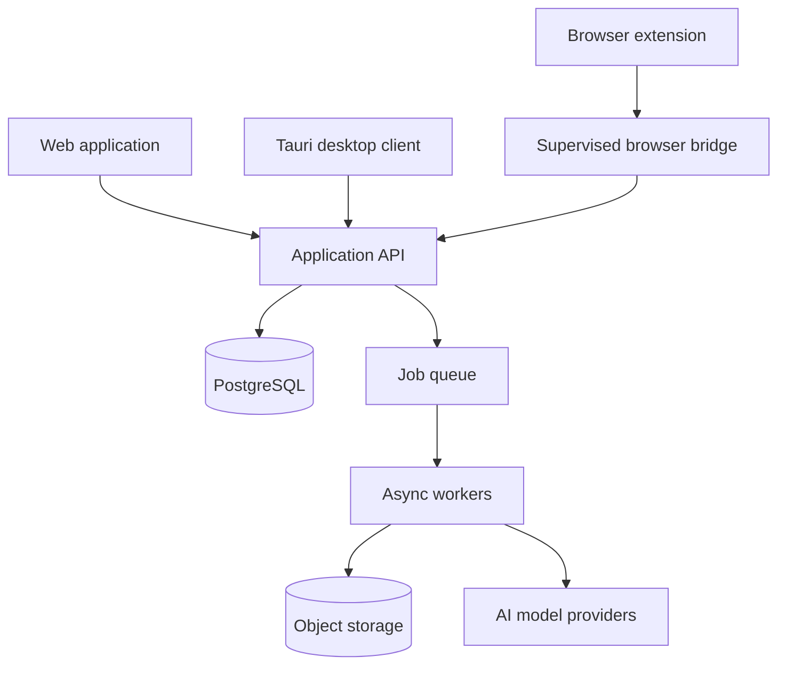

# Craftivora — AI Commerce Operations Platform

An AI-assisted commerce and creative-operations platform developed with Claude Code.

> **Portfolio edition:** architecture and capabilities are documented publicly while source code, prompts, credentials, customer data and production infrastructure remain private.

## Product vision

Craftivora coordinates research, content creation, digital-product workflows and commerce operations through a modular agent platform. It combines a web application, desktop client, browser bridge, API services and asynchronous workers under explicit approval and audit controls.

## Technical highlights

- TypeScript monorepo with shared packages and independently deployable services
- React web client and Tauri desktop application
- API, job-worker and Telegram service boundaries
- PostgreSQL-backed data foundations and migration tooling
- Browser-extension bridge for supervised workflows
- Object-storage integration for generated artifacts
- AI model routing for text, vision and creative workloads
- Tests, operational runbooks, capability matrices and verification reports
- Human approval gates for external or sensitive actions

## High-level architecture

## Engineering approach

The platform follows evidence-based readiness levels: a capability is not described as production-ready until the corresponding build, test or live verification exists. Destructive and representational actions require explicit approval, and operational boundaries are documented alongside implementation status.

## Development with Claude Code

Claude Code supported architectural analysis, staged implementation, test generation, code review and operational documentation. Product direction, acceptance criteria, security decisions and release approval remained human responsibilities.

## Intellectual property

Copyright © 2026 Claudia Garau. All rights reserved.

The implementation, prompts, workflows, datasets, commercial assets and infrastructure configuration are proprietary and are not distributed with this showcase.

## Portfolio code samples

The `portfolio-review` branch contains focused TypeScript excerpts and tests for validated catalog jobs, deterministic slugs and explicit human approval gates. AI providers, storage, prompts and production infrastructure remain private.
